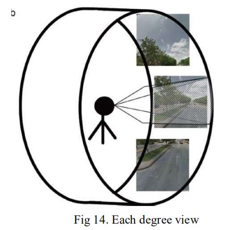

# The project has been divided into six parts 
* [Select the Region and mark Checkpoints](#Select-the-Region-and-mark-Checkpoints)
* [Collecting the data (images) from Google Street View](#Collecting-the-data-(images)-from-Google-Street-View)
* [Removing the objects from the images](#Removing-the-objects-from-the-images)
* [Segment the images](#Segment-the-images) 
* [Calculating the Green View Index (GVI) of images and Prepare an excel File.](#Calculating-the-Green-View-Index-(GVI)-of-images-and-Prepare-an-excel-File) 
* [Analyzing the output and adding it to the Site.](#Analyzing-the-output-and-adding-it-to-the-Site)
* [What to Fetch from GSV API.](#What-to-Fetch-from-GSV-API)

## Select the Region and mark Checkpoints
* This is the first step, first a region where Google street view is available is selected. 
* Certain check points are selected (figure 4), with around 500-600 m minimum distance between 
them. 
* All the latitudes and longitudes of the checkpoints are stored in a excel file (figure 3).

## Collecting the data (images) from Google Street View
* Images are taken from the Google street View API (Static Street View API)(fig). 
* The Http request is made for collecting the images. 
* HttpRequest:-
http://maps.googleapis.com/maps/api/streetview?size=400x400&location=40.7225780677,%20
-73.9871877804&fov=90&heading=270&pitch=10&sensor=false
* The size of the images is set constant for all the images i.e. 400x400. 
* Also the fov, pitch, and heading parameters are set accordingly for generating a image.

## Removing the objects from the images
* For removing objects from the image such that for the GVI calculation the greenery from 
objects and reflection of trees in objects (reflection of tree on car) YOLO object detection 
algorithm is used. YOLO is deep learning-based object detector. YOLO use a one-stage 
detector strategy. YOLO works on Microsoft COCO dataset. 
* After detecting object present in COCO dataset by YOLO algorithm that coordinates are taken. 
* The pixels of objects are then set as RGB (255,255,255) i.e. white. Then segmenting and GVI 
calculation is done on that images.

## Segment the images
* Images sometimes have shiny parts also glare too much. 
* It is easy if the image is represented as colored pencil image. 
* Therefore Segmentation is used. 
* Here K means Segmentation. 
* K-means Clustering algorithm is applied to segment image as its make clusters of image as Red 
cluster, Green Cluster, Blue cluster.(figure 7)

## Calculating the Green View Index (GVI) of images and Prepare an excel File
* For Calculating the GVI we calculate the green area pixels in image and also calculate the total 
area of image i.e. 400x400. 
* A binary image is generated where green area is white and other area is black(fig). 
* For this we do operations in image as mentioned in figure 9. 
* For calculating the threshold OTSU BINARIZATION ALGORITHM is used.

## Analyzing the output and adding it to the Site

## What to Fetch from GSV API
* Accuracy in calculating the GVI is important aspect. 
* For each check point GVI is calculated ,but for each check point all its images of 360deg is 
taken and an image is divided into 6 parts of 60deg each.(fig) 
* Each image has 3 sights such as -45 deg,0 deg,45 deg. So, in total 6x3 = 18 images are 
generated for one check point and average of GVI is taken. (figure 13,14 ) 
* As there are many regions where street view is not there so top –view is taken in consideration 
for that. 
* These images of different fov, heading, pitch is generated by querying to the Google Static 
street API by manipulating its arguments.

